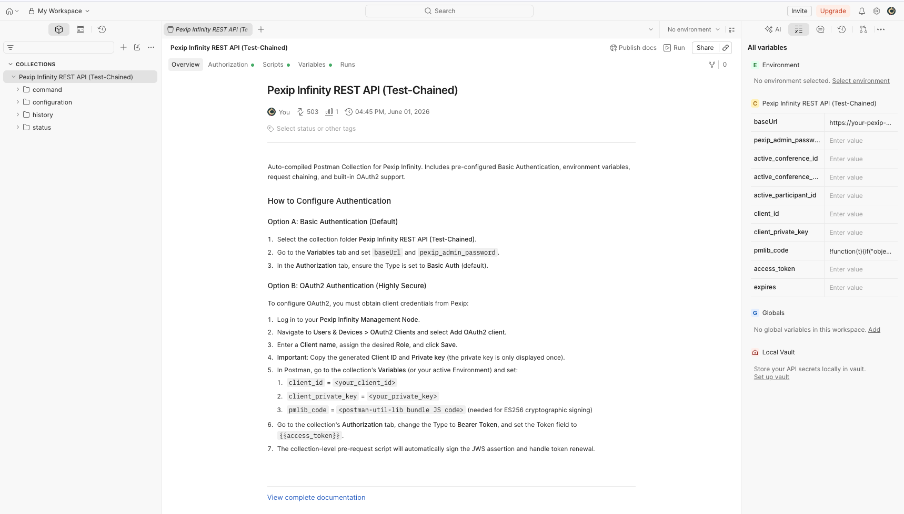
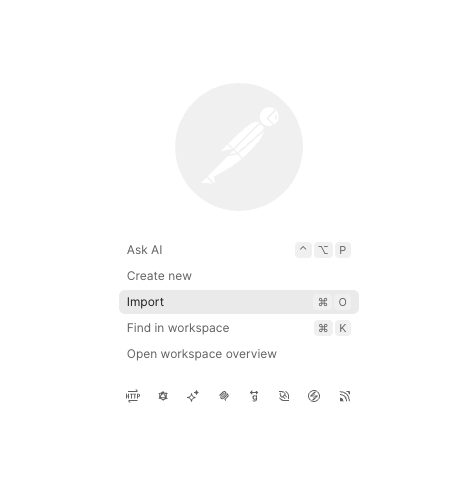
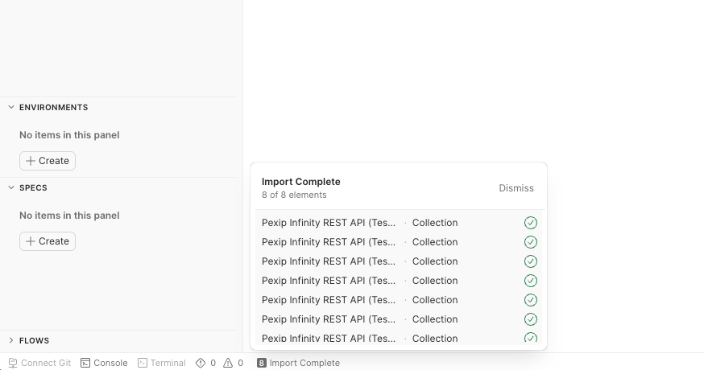
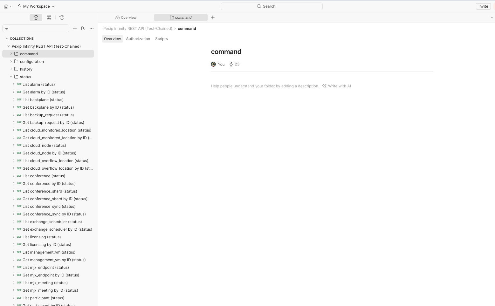

# Pexip API Postman Tools

This repo contains utilities to dynamically fetch the JSON schemas from a live Pexip Infinity Management Node, compile them into an OpenAPI 3.0 spec, and then generate a full Postman Collection. You can run the **`generate_spec.py`** against your own Infinity deployment or simply drag and drop the precompiled collections into Postman for the complete collections.



---

## What are these files?

- **`generate_spec.py`**: A Python script that queries the Management Node's active schema registry and writes `openapi.json`.
- **`openapi.json`**: The compiled 1.17 MB OpenAPI 3.0 specification.
- **`compile_postman.py`**: A Python compiler that translates `openapi.json` into a native, request-chained Postman Collection.
- **`pexip_postman_collection.json`**: The pre-compiled Postman Collection ready for drag-and-drop import.
- **`pexip_postman_environment.json`**: The pre-compiled Postman Environment ready for drag-and-drop import.
- **`pre-auth-script`**: The raw Postman Pre-request JavaScript code used to dynamically sign JWT assertions and fetch OAuth2 tokens.
- **`.env.example`**: An example environment configuration template for `generate_spec.py`.

---

## Running the Spec Generator

If you want to dynamically regenerate the specification from a live Pexip Management Node:

1. Copy `.env.example` to `.env`:
   ```bash
   cp .env.example .env
   ```
2. Open `.env` and configure your Pexip Management Node details (`PEXIP_HOST`, `PEXIP_USER`, `PEXIP_PASSWORD`).
3. Install requirements and run the generator script:
   ```bash
   pip install requests python-dotenv
   python3 generate_spec.py
   ```

---

## Quick Start: Import & Configure in Postman

You do **not** need to run any Python scripts if you just want to use the API! You can simply drag and drop the pre-compiled files into your workspace.

1. Open **Postman**.
2. Click **Import** in the top-left corner or in the middle of your workspace.

   

3. Drag and drop **BOTH** the **`pexip_postman_collection.json`** and **`pexip_postman_environment.json`** files at the same time into the import window.

   

4. Once imported, select the **Pexip Infinity REST API Environment** from the environment dropdown in the top-right corner of Postman.
5. In the left sidebar of Postman, select **Environments**, click on the **Pexip Infinity REST API Environment**, and edit your credentials there.

> [!WARNING]
> **Do not configure anything in the Collection's or Request's "Authorization" tab.**
> The collection is designed to use **"No Auth"** (or "Inherit auth from parent"). All authentication headers (whether Basic or OAuth2 Bearer Token) are **dynamically injected on-the-fly** by the Pre-request Script. Editing the Authorization tab manually will conflict with the script and cause `401 Unauthorized` errors!

Choose your preferred authentication method below to fill out the variables, then click **Save** (`Cmd + S`).

### Option A: Basic Authentication (Default)

- Set `baseUrl` to your Pexip Management Node URL (e.g. `https://your-pexip-manager.example.com`).
- Set `pexip_admin_username` to your username (defaults to `admin` if left blank).
- Set `pexip_admin_password` to your admin password (displays masked).
- Send any request — Basic Auth is dynamically generated and injected when no OAuth2 credentials are set.

### Option B: OAuth2 Authentication (Recommended)

1. Log in to your **Pexip Infinity Management Node**.
2. Go to **Users & Devices > OAuth2 Clients** and select **Add OAuth2 client**.
3. Enter a **Client name**, select the desired **Role**, and click **Save**.
4. **Important**: Copy the generated **Client ID** and **Private key** (you must copy the private key immediately, as it won't be shown again).
5. In your Postman Environment variables, set:
   - `client_id` = your generated Client ID.
   - `client_private_key` = your generated Private Key (displays masked).
6. Send any request — the pre-request script automatically detects your OAuth2 credentials, signs the JWT assertion, fetches a Bearer token, and dynamically injects the `Bearer` token header. The collection is configured to use **No Auth** by default, and all authentication headers are handled dynamically. No manual configuration of the Authorization tab is needed.

### Troubleshooting: SSL Verification (Self-Signed Certificates)

If your requests fail immediately with **"Could not get any response"** or connection issues:
- Pexip Management Nodes often use self-signed SSL certificates, which Postman blocks by default.
- **To resolve**: Open Postman **Settings** (gear icon in the top right) -> **General** tab -> toggle **SSL certificate verification** to **OFF**.

---

## Core Management APIs & Endpoints

Now you can select from the core management APIs and their various endpoints to test. The collection is organized into the following main directories:

- **`configuration`**: Endpoints for managing persistent system configurations (like adding users, editing locations, setting up NTP servers, or registering licenses).
- **`status`**: Read-only queries to pull the live, active state of your conferencing systems, live calls, and connected participants.
- **`command`**: Outbound calling, moderator controls, and platform operations (e.g. dial-out, muting participants, locking/unlocking, LDAP synchronization, or taking platform snapshots).
- **`history`**: Access to past conference logs and history records (CDRs) for auditing and reporting.



---

## Testing the Request Chaining Flow

1. Go to `status` -> `List conference (status)` and click **Send**.
2. Check your Postman variables; you'll see `active_conference_id` has been auto-populated with the running meeting UUID!
3. Open `command` -> `Lock conference VMR` and click **Send**. The meeting will lock instantly.

---

## Note: Request Chaining & Disabled Filters

The custom generator (`compile_postman.py`) will pre-configure some variable chaining for common paramters like conference id and participant id. It will also disable many of the optional parameters by default to deliver the raw response and avoid any errors.

1. **Disabled Optional Filters**: All filter parameters in the **Params** tab (like `details`, `instance`, etc.) are **unchecked by default**. Only `limit` and `offset` are active, resolving the Tastypie string parameter parsing errors.
2. **Variable Chaining**:
   - When you run `GET List conference (status)`, it automatically extracts the first active VMR ID and saves it to the variable `active_conference_id`.
   - When you run `GET List participant (status)`, it extracts the first connected caller ID and saves it to `active_participant_id`.
3. **Pre-populated Command Bodies**: Command requests like `POST Disconnect a participant` or `POST Lock conference VMR` are pre-filled with these dynamic variables (e.g. `{"participant_id": "{{active_participant_id}}"}`), allowing you to moderate live calls without copy-pasting IDs.
